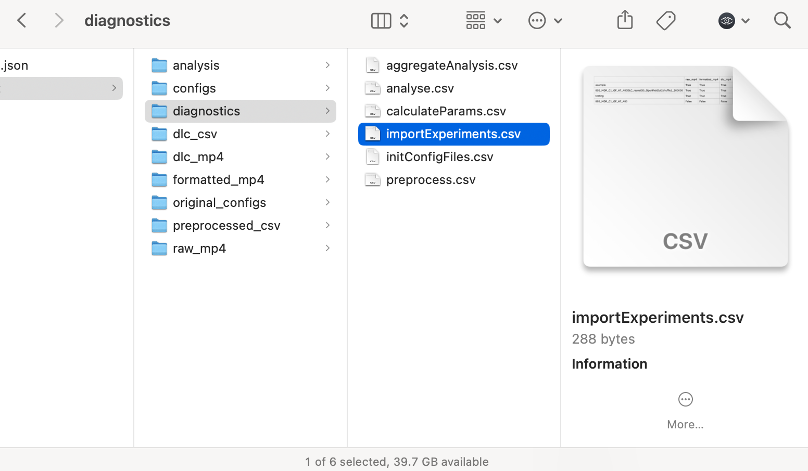

# Diagnostics Messages

## The Diagnostics Outputs

After any process is run, a diagnostics file with the name of the process is generated in the diagnostics folder.

An example of what this can look like is shown below.

## Common Errors and Warning

In the diagnostics file, an **error** is something that has caused the processing of the experiment to fail completely. A **warning** is something that the program detected as unusual - it won't cause the program to fail but it is worth noting because it may affect future processes.

Common warnings and errors that may arise are shown below, grouped by the process they usually occur in:

- updateConfigFiles
  - The user-given value for `config_fp` may be an incorrect filepath or that cconfig file itself may not be in a valid JSON format (e.g., a bracket or a comma might be missing). You can use one of the configs templates.
- formatVideos
  - The raw mp4 file may be missing or corrupted. Please try to open this file to see if this is the case.
  - Sometimes, the resolution is an uncommon value and the downsampling fails. When this happens, the video is instead copied and the diagnostics file notes that the video failed to downsample and was copied instead.
- runDLC
  - The specified dlc_config_path may be missing or incorrect. Please check that the correct filepath is used.
- calculateParams
  - Throughout all the processes run within calculateParams, if any necessary parameter in the configs file are missing, then an error is added to the diagnostics file and the specific process stops. Future processes are usually affected by this error.
  - getVideoMetadata
    - If the video file does not exist or is corrupted, then a warning is added the diagnostics file.
  - calcStartFrame
    - If the bodypart listed in the config file is not in the dlc_csv file, then a warning is thrown and the invalid bodypart is ignored.
    - If the subject is not detected in any frames, then a warning is added to the diagnostics file. Please open and check the video to see if this is the case.
  - calcEndFrame
    - If the user-specified dur_sec (duration of the experiment in seconds) is larger than the length of the video, then a warning is added to the diagnostics file. Please open and check the video to see if this is the case.
  - calcPxPerMM
    - If the labels, "TopLeft", "TopRight", "BottomLeft", or "BottomRight", are missing from the dlc_csv file (i.e., if any of the box corners were not tracked), then an error message is added to the diagnostics file. Please ensure that you are using a DLC model that tracks the arena edges.
- preprocessing
  - Please note that some processes run within preprocessing depend on calculateParams. If there were any failed processes in calculateParams, please troubleshoot them before moving onto here.
  - Throughout all the processes run within preprocessing, if any necessary parameter in the configs file are missing, then an error is added to the diagnostics file and the specific process stops. Future processes are usually affected by this error.
  - InterpolatePoints:
    - If the bodypart listed in the config file is not in the dlc_csv file, then a warning is thrown and the invalid bodypart is ignored.
- analysis
  - Please note that most processes run within analysis depend on preprocessing. If there were any failed processes in calculateParams, please troubleshoot them before moving onto here.
- aggregateAnalysis
  - The analysis process must be successfully run before the files generated from it can be aggregated.
