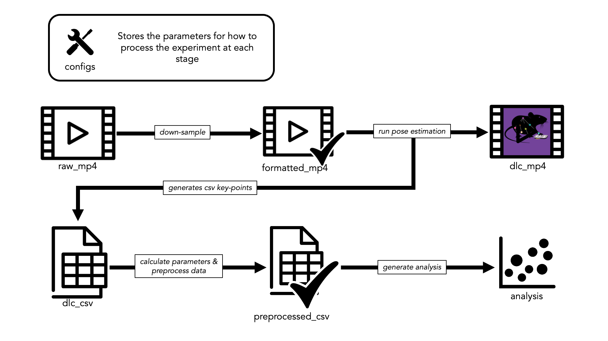

# Explanation

The behavysis_pipeline is used to analyse raw mp4 footage of lab mice. Analysis can include:

- Open Field
  - Subject thigmotaxis
  - Subject speed
- Choice (need to implement)
- etc.

Converting raw mp4 footage to interpretable data and analysis involves the following steps:

1. Setting up a BA project. This project will perform all the calculations to render analysises.
2. Importing all the raw videos to into the project.
3. Formatting all the raw videos so they can be interpreted by the DeepLabCut (DLC) pose estimation model.
4. Run the formatted videos through the DLC pose estimation model to generate a video with the pose markers and a csv file of x-y coordinates of each marker (e.g., nose, left ear, right ear, body, front right foot, etc.).
5. Preprocess the csv file of x-y marker coordinates so it is ready for analysis.
6. Generate analysis from the preprocessed x-y marker coordinates file.

## Making a Project to Analyse

The experiment files must be stored in the computer in a certain way so the program can analyse them.
Files pertaining to each experiment must be stored in folders with specific names.
The overall way that the files are structured in a project are shown below.

For more information about how to set up experiment files, see [setup](../tutorials/setup.md)
