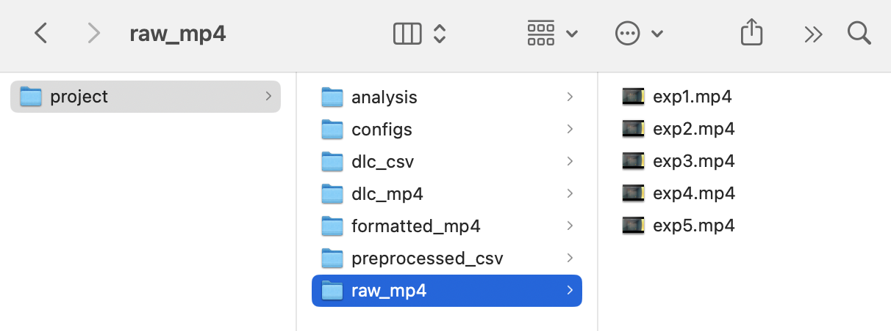

# Setup

Before running the ba_pipeline analysises, the files that we want to analyse must be set up a certain way for the ba_pipeline program to recognise them.

There are three important guidelines to set up the project:

- Structure of files in folders .
- Experiment files.
- Config files for each experiment.

## Folder Structure

They need to be set up inside specially named folders, as shown below.

An example of how this would look on a computer (in this case, a Mac) is shown below.

## Experiment Files

Each experiment must have files that have same name (not including the suffix like `.csv` or `.mp4`). An example is "day1_experiment1" must have all files named "day1_experiment1.mp4", "day1_experiment1.csv", "day1_experiment1.json" etc. stored in the corresponding folder.

## Config Files

The config file for an experiment stores all the parameters for how the experiment was recorded (e.g., the frames per second of the raw video, the experiment duration, etc.), and the parameters for how we want to process the data (e.g., the intended frames per second to format the video to, the DLC model to use to analyse, the likeliness pcutoff to interpolate points, etc.)

An example of a config file is shown in [The Configs File](configs_setup/configs_setup.md) page.

# Running ba_pipeline

To install `ba_pipeline`, follow [these](../installation/installing/conda_windows.md) instructions.
To run `ba_pipeline`, follow these [these](../installation/running/conda.md) instructions.
